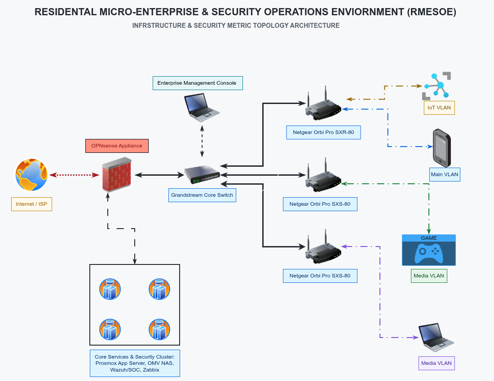
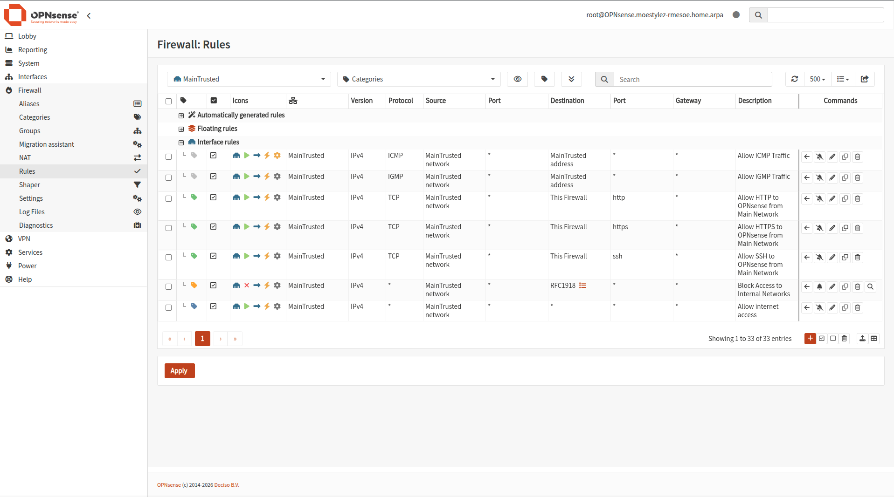
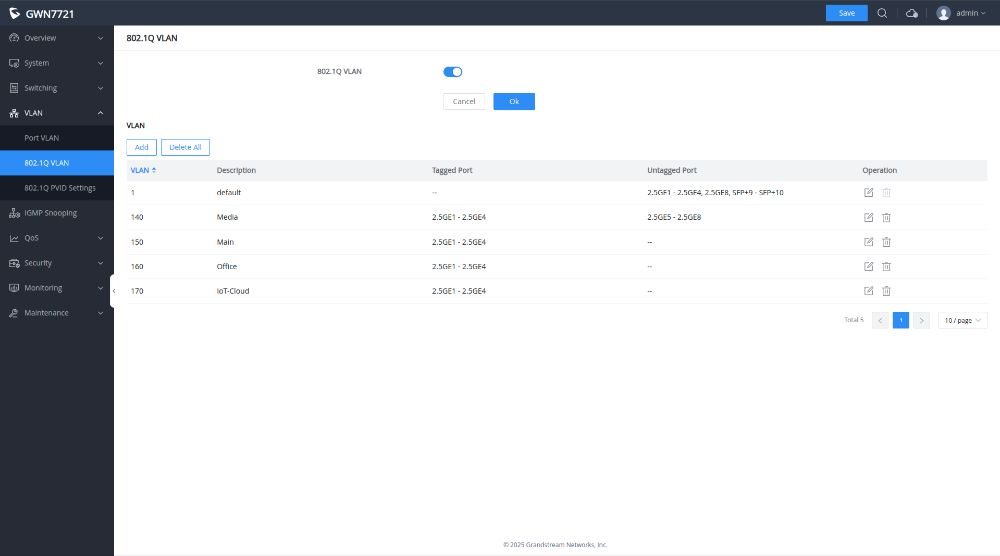
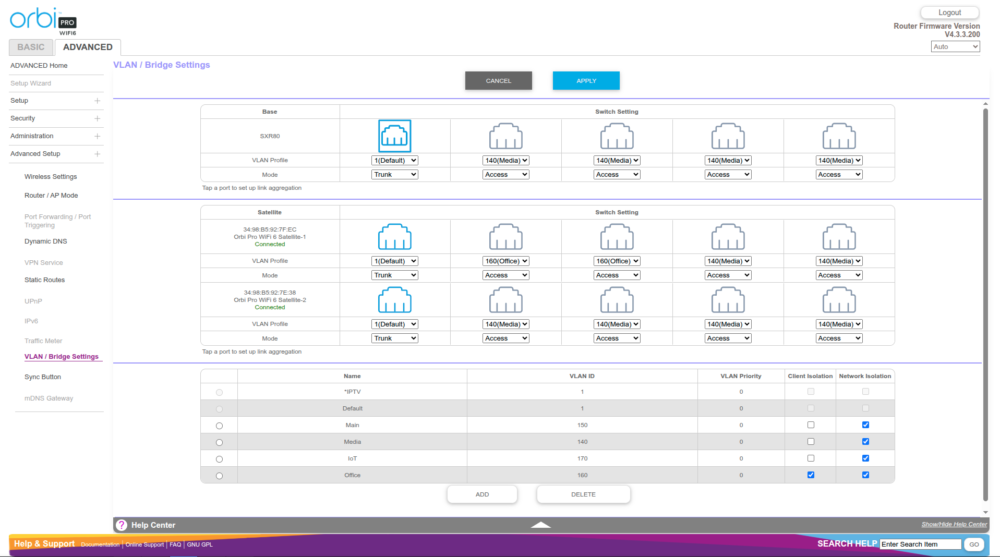

# OPNsense Perimeter Defense & Resilient DNS Architecture

<a href="https://github.com/gregorymoorejr">← Back to Main Portfolio</a>

## Overview
This project details the design, implementation, and hardening of my home network's perimeter defense and core routing architecture. Built on an **OPNsense** firewall, the environment enforces strict least-privilege access using multi-VLAN segmentation combined with a robust, multi-layered DNS resolution and filtering stack.

---

## Architecture & Traffic Flow

    

### Core Hardware & Infrastructure Layer (VLAN 90)
* **Firewall & Routing Engine:** Custom Lenovo M800 SFF running **OPNsense**
* **Switching Core:** **Grandstream GWN7721 Managed Switch**, configured for **802.1Q VLAN trunking** and strict port-based tag enforcement.
* **Wireless Access Layer:** **Netgear Orbi Pro WiFi Mesh System**, utilizing **Multi-SSID mapping** to bridge wireless clients directly into dedicated OPNsense VLAN zones (Trusted, Guest, and IoT).
* **Physical Backbone:** MoCA adapters utilizing coaxial runs and CAT6 Ethernet cabling to maintain high-throughput wired stability across physical domains.

### Custom Hardware Edge Appliance (OPNsense Firewall)
* **Host Chassis:** Lenovo ThinkCentre M800 SFF running **OPNsense**
* **Memory:** 24GB DDR4 RAM
* **Storage:** 512GB SSD
* **Interfaces:** Dual-port 2.5GbE PCIe NIC (WAN & trunking) + Quad-port 1GbE PCIe NIC (dedicated hardware segments/passthroughs).

---

## Configuration & Verification Snapshots

### 1. OPNsense Inter-VLAN Firewall Rules
Enforcing least-privilege access by explicitly denying unauthorized east-west traffic, RFC1918 block rule, between segmented zones (e.g., restricting IoT and Guest subnets). Specificly allowed traffic is placed above the RFC1918 block rule. 

    

### 2. Grandstream Switch 802.1Q VLAN Enforcement
The Grandstream GWN7721 managed switch enforces strict Layer 2 isolation, ensuring tagged frames from OPNsense remain properly separated across physical switch ports.

    

### 3. Netgear Orbi Pro Multi-SSID VLAN Mapping
Wireless networks are segregated at the access point level, mapping distinct SSIDs directly to their respective OPNsense VLAN tags (e.g., Trusted on VLAN 150, IoT on VLAN 170).

    

---

## VLAN & Subnet Breakdown

| VLAN ID | Subnet Zone | Purpose & Dedicated Hardware Implementation |
| :--- | :--- | :--- |
| **VLAN 80** | Application Servers | Hosts application containers/servers running on Proxmox VE hosted on a repurposed **Dell Precision 7530**. |
| **VLAN 90** | Infrastructure | Core network backbone for OPNsense, Netgear Orbi Pro WiFi mesh, MoCA adapters, and the Grandstream GWN7721 managed switch. |
| **VLAN 100** | Management Subnet | Dedicated console management network running **SysLinuxOS on a Microsoft Surface Pro 3**. Central administrative point for all infrastructure devices and servers. |
| **VLAN 110** | Network Monitoring | Dedicated subnet for infrastructure health monitoring via **Zabbix** running on a repurposed **Dell Inspiron 15 5566**. |
| **VLAN 120** | SOC / SIEM | Dedicated subnet for security operations and log analysis via **Wazuh SIEM** running on a repurposed **Dell Precision 5530**. |
| **VLAN 130** | Network Attached Storage | Dedicated subnet for data storage utilizing **OpenMediaVault** running on a repurposed **Dell Inspiron 15 5568**. |
| **VLAN 140** | Home Entertainment | Subnet for smart TVs, gaming consoles, and network-enabled desktop media players. |
| **VLAN 150** | Main / Trusted | Primary subnet for personal computers, smartphones, and network printers. |
| **VLAN 160** | Home Office & Guest | Segmented network allocated for home office productivity and guest wireless access. |
| **VLAN 170** | IoT Subnet | Isolated zone for smart home appliances, thermostats, and security cameras. |

---

## DNS Security & Resolution Pipeline
* **AdGuard Home:** Acts as the primary network-wide DNS sinkhole, intercepting telemetry, trackers, and malicious domains.
* **Unbound DNS:** Configured as the upstream recursive resolver for AdGuard Home, performing direct DNS queries to authoritative root servers.
* **Dnsmasq:** Handles local DHCP-driven name resolution and internal network routing for local container and host names.

---

## Future Roadmap & Enhancements
* **Zenarmor Integration:** Deployment of Layer 7 deep packet inspection (DPI) and application-layer telemetry on OPNsense.
* **CrowdSec Integration:** Implementation of collaborative security agents and firewall bouncers for active threat intelligence.
* **Q-Feeds Integration:** Incorporation of custom threat intelligence feeds to tighten perimeter block policies.

---

<a href="https://github.com/gregorymoorejr">← Back to Main Portfolio</a>
